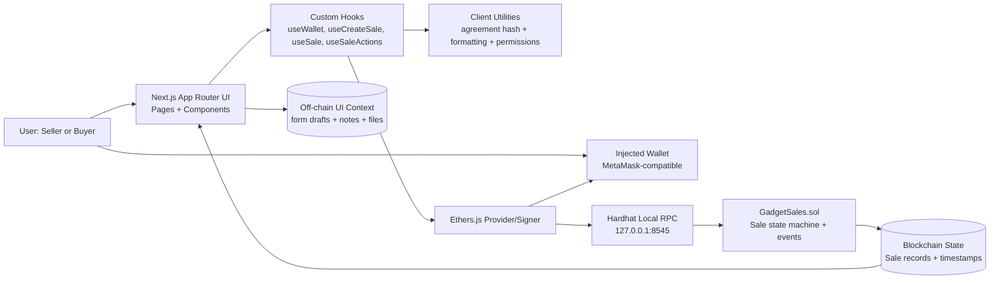
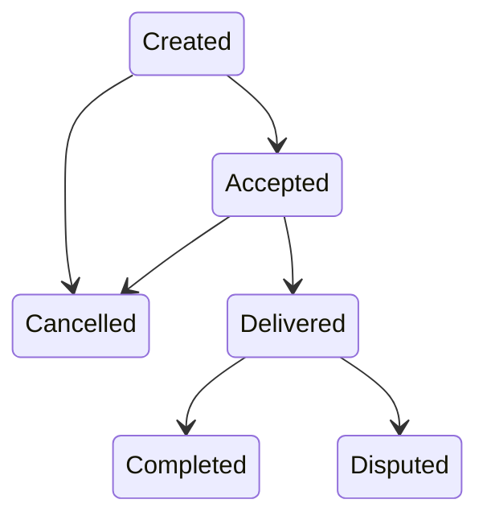

# GadgetSales

GadgetSales is a blockchain-based transaction verification prototype for second-hand gadget sales. It helps buyers and sellers keep one shared, tamper-resistant record of what they agreed to and how the sale progressed.

## Project Overview

GadgetSales focuses on recording sale agreements and lifecycle updates on-chain:
- Seller creates a sale record.
- Buyer accepts the sale.
- Seller marks it delivered.
- Buyer either confirms completion or opens a dispute.

The application is intentionally scoped as an MVP and avoids marketplace and payment complexity.

## System Architecture

GadgetSales uses a frontend-only Web3 architecture for MVP: Next.js handles UI and interaction logic, ethers.js connects to an injected wallet, and all sale-state writes are executed through a Solidity smart contract.



### Architecture Notes

- Frontend only: no backend API server and no database in MVP.
- Wallet is identity: actor permissions are enforced on-chain by wallet address.
- Deterministic agreement hash is generated client-side before `createSale`.
- Smart contract is the source of truth for status, timestamps, and transitions.
- UI reads from contract state/events and mirrors lifecycle progress in dashboard/detail pages.

## Real-World Problem

Second-hand gadget transactions often rely on chat messages that can be edited, deleted, or disputed later. This creates confusion about what was agreed and when key actions happened.

GadgetSales addresses this by recording the sale agreement hash and status updates in smart contract state and events so both parties can verify the transaction history from the same source.

## Why Blockchain Fits

Blockchain is a good fit for this problem because the app needs:
- A shared record between independent parties.
- Tamper-resistant status transitions.
- Transparent timestamps and actor addresses.
- Deterministic, auditable transaction logs.

The goal is transaction verification, not gadget authenticity verification.

## MVP Features

- Create sale with gadget details, condition, price, agreement hash, and optional proof hash.
- Accept sale (buyer only, and not the seller).
- Mark delivered (seller only).
- Confirm receipt (buyer only).
- Open dispute (buyer only from Delivered).
- Cancel sale (seller only from Created or Accepted).
- View sale details and status timeline.
- View dashboard lists for seller-created and buyer-accepted sales.

## User Roles

- Seller:
  - Creates sale records.
  - Cancels from valid states.
  - Marks delivered after buyer acceptance.
- Buyer:
  - Accepts a created sale.
  - Confirms receipt or opens dispute after delivery.
- Viewer:
  - Can read sale details and status history.

## Smart Contract State Flow



Terminal states are `Completed`, `Disputed`, and `Cancelled`.

## On-Chain vs Off-Chain Data

### On-Chain

- Sale ID
- Seller address
- Buyer address
- Price
- Gadget name
- Brand/model
- Condition summary
- Agreement hash
- Optional proof hash
- Status and status timestamps

### Off-Chain

- Long notes and expanded context
- Photos and receipt files
- UI-only convenience state

The app does not use a backend database for MVP.

## Local Development Setup

### Prerequisites

- Node.js 18+
- npm
- MetaMask-compatible wallet

### Setup

```bash
npm install
```

### Run Core Checks

```bash
npm run lint
npm run build
npx hardhat compile
npx hardhat test
```

### Start Local Chain and Deploy

Terminal 1:

```bash
npx hardhat node
```

Terminal 2:

```bash
npx hardhat run scripts/deploy.ts --network localhost
```

Copy the deployed contract address into `.env.local`:

```env
NEXT_PUBLIC_CONTRACT_ADDRESS=0xYourDeployedAddress
NEXT_PUBLIC_CHAIN_ID=31337
NEXT_PUBLIC_RPC_URL=http://127.0.0.1:8545
```

Run the app:

```bash
npm run dev
```

## Manual Demo Script

Use this exact sequence for presentation:

1. Start local node: `npx hardhat node`.
2. Deploy contract: `npx hardhat run scripts/deploy.ts --network localhost`.
3. Copy deployed address to `.env.local` as `NEXT_PUBLIC_CONTRACT_ADDRESS`.
4. Run app: `npm run dev`.
5. Connect seller account in MetaMask.
6. Create sale from `/create`.
7. Switch to buyer account.
8. Open the sale detail page and accept sale.
9. Switch back to seller account.
10. Mark delivered.
11. Switch to buyer account.
12. Confirm receipt.
13. Repeat with a new sale and use dispute path: Accept -> Delivered -> Disputed.
14. Repeat with another sale and use cancel path: Created -> Cancelled or Accepted -> Cancelled.

## Known Limitations

- No escrow or real payment handling.
- No chat or messaging.
- No authentication backend; wallet address is identity.
- No marketplace browsing/search/ranking.
- No IMEI or serial verification.
- No automated dispute resolution.
- No guarantee of gadget physical authenticity, condition, or ownership legitimacy.

## Future Improvements

Potential post-MVP improvements (outside current scope):

- Better indexing for large sale histories.
- Optional file storage integration for proof artifacts (store hash on-chain, file off-chain).
- Richer analytics and reporting views for presentation.
- Network/environment health checks and UX guidance.

## Scope Confirmation

No out-of-scope features are included in this MVP:
- No escrow
- No chat
- No authentication system
- No marketplace search/browsing
- No backend/database
- No IMEI/serial verification
- No NFTs/tokens

## Disclaimer

This project is an educational prototype for transaction verification workflows on a blockchain. Use local/test environments only.
